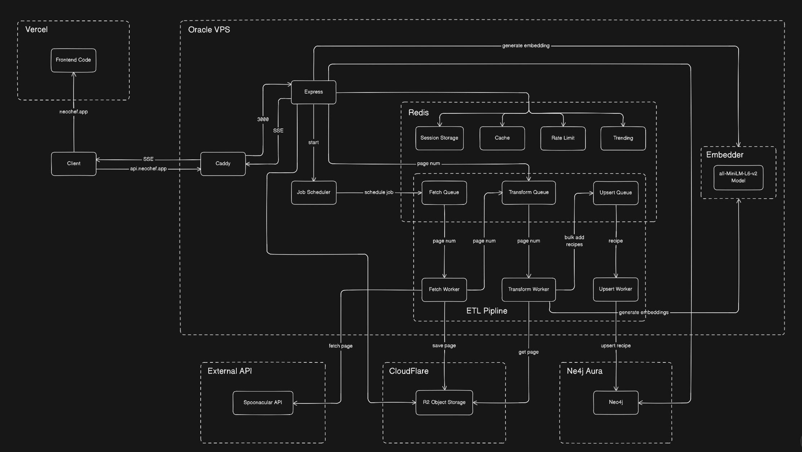
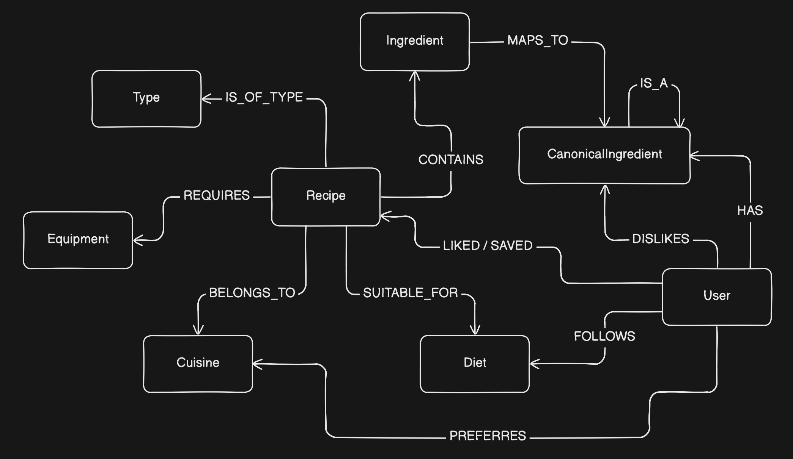

# NeoChef 🍲

**Recipe Recommendation Web App powered by a `Neo4j` graph model enabling `personalized` and `context-aware` recipe suggestions.** The project is designed as a scalable full-stack app demonstrating best real‑world backend, frontend, and DevOps practices.
> 🌐 Live at: **https://neochef.app**

---

## System architecture 🏛️

---

## Database Schema 🗄️

---

## Features 🚀

### Backend ⚙️
- 🧠 **Personalized recommendation engine** built on a `Neo4j` graph data model, leveraging complex `weighted Cypher queries` (user similarity, ingredient and categories overlap, interaction weights) and neo4j built in `vector indexes`.
- 📬 **Event-driven** ETL pipeline: Recipes are fetched from the Spoonacular API, transformed, embedded, and upserted into Neo4j through a scalable, `event-driven` workflow powered by `Redis` message queues and `BullMQ` background workers.
- 🤖 **Local Embedding service** powered by tiny quantized in memory `all-MiniLM-L6-v2` model, used for generating `embbedings`.
- 📡 **Real-time admin dashboard** powered by `Server-Sent Events` (SSE) for live background job monitoring and status updates
- ⚡ **Redis‑backed performance layer for reducing database load and response latency**:
  - 🗄️ Caching of `CPU‑intensive` recommendation queries and `frequently used` data
  - 📬 Redis‑backed `message queues` for background jobs and ETL workflows
  - 📈 Trending page implemented with `Redis ZSETs` (leaderboard pattern)
  - 🚦 Custom Redis‑backed `rate limiting` and `session storage`
- 🔁 **Unit of Work pattern** for sharing `transactional context` across multiple repositories within a single service operation, ensuring `consistency` for multi‑step domain operations such as recipe imports
- 🧱 **Production best practices**: layered architecture (`routes` → `controllers` → `services` → `repositories`), dependency injection, typed domain errors, global error handling, `Zod` validation, and full `TypeScript` coverage.

### Frontend 🎨 
- 🧰 **Modern React architecture** using `TanStack Query` and `TanStack Router` to enable advanced patterns like:
  - 🚀 Route‑level prefetching and fetch‑on‑navigation
  - 🗄️ Client‑side caching and deterministic cache invalidation
  - ⚡ Optimistic UI updates
- 📱 **Fully responsive and accessible UI** built with `Tailwind CSS` and `shadcn` components.
- ✨ **UX optimizations** such as skeleton loaders and smooth state transitions.

### Infrastructure & Deployment ☁️
- 📦 **Monorepo setup** with npm workspaces (`common`, `core`, `client`, `server`, `jobs`, `embedder`) shared core busines logic and types/utilities.
- 🐳 **Backend containerized with `Docker` & `Docker Compose`, running five services:
  - 🖥️ API server
  - 🤖 Embedding service (`all-MiniLM-L6-v2` model)
  - 🏗️ 3 Background workers (`fetch`, `transform`, `upsert`)
  - ⚡ Redis (`message queues`, `caching`, `rate limiting`, `session storage`, `leaderboard`)
  - 🧭 Caddy `reverse proxy`
- 🌍 **Frontend** deployed to `Vercel` with CDN distribution and automatic deployments.
- 🏗️ **Backend** deployed on an `Oracle VPS`.
- 🗄️ **Database** `Neo4j Aura` Managed instance
- 📦 **Object Storage** `Cloudflare R2` Storage

---

## Run Locally (Dev Environment) 🏠 

- Install `Docker`
- Add `.env.dev` files to `/server` and `/jobs` according to `.env.example` files
- Run `npm run dev` from root directory `/`
- App is running on `localhost`
- Admin account - email: `admin@gmail.com` password: `Admin12!`

---

## Tech Stack 🧱

| Layer | Technology |
|-------|------------|
| Backend | Node.js, Express, BullMQ, TypeScript |
| Frontend | React, TanStack Query, TanStack Router, Tailwind CSS, shadcn |
| DevOps | Docker, Docker Compose, Vercel, Oracle VPS deployment, Claudflare, Neo4j Aura|
| Architecture | Monorepo (npm workspaces), layered architecture, dependency injection, Unit Of Work |

---
